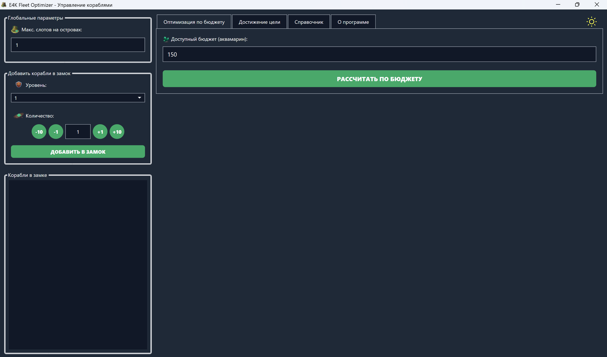
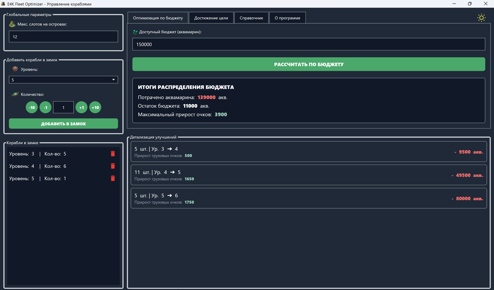
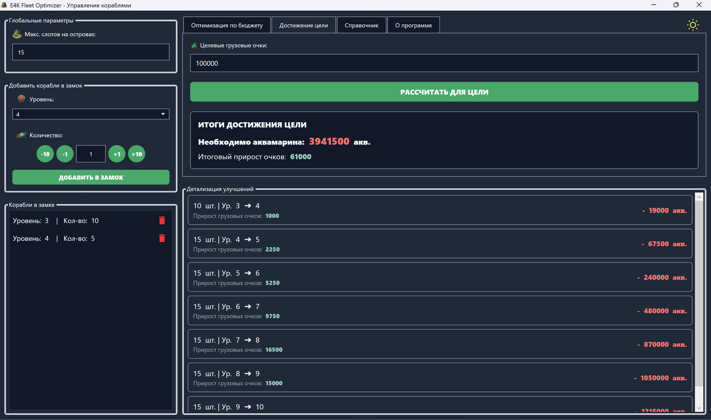
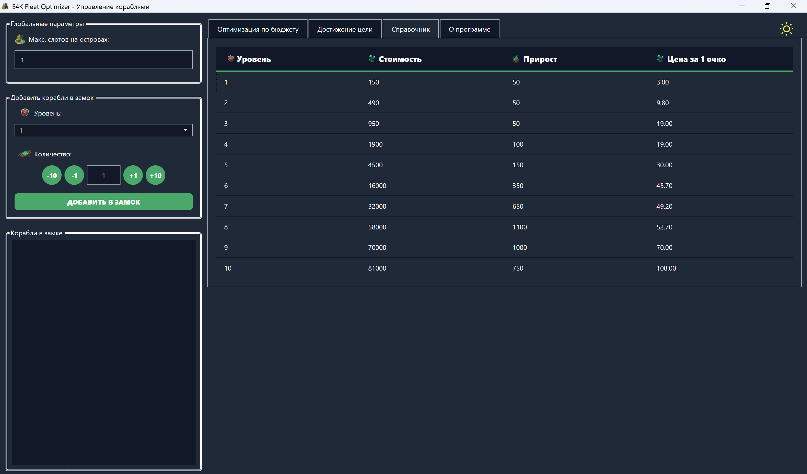

[English](README.md) | [Українська](README.uk.md) | [Русский](README.ru.md)

---

# ⚓ E4K Fleet Optimizer

Спеціалізована десктопна утиліта для **[Empire: Four Kingdoms](https://play.google.com/store/apps/details?id=air.com.goodgamestudios.empirefourkingdoms)**. Цей інструмент повністю усуває необхідність ручних математичних розрахунків, автоматично обчислюючи найефективніші комбінації кораблів для слотів вашого флоту, забезпечуючи максимальну місткість та оптимізовані характеристики.

## ✨ Можливості
* **Автоматичний розрахунок флоту:** Миттєво розраховує найкращий розподіл кораблів для досягнення максимального прибутку та ефективності.
* **Розумна оптимізація слотів:** Точно розміщує кораблі в доступні слоти на основі їхніх індивідуальних характеристик та вантажопідйомності.
* **Сучасний інтерфейс:** Елегантний, повністю оптимізований користувацький інтерфейс, що підтримує як **Темну, так і Світлу теми**, створений для вашого комфорту.
* **Автономна обробка:** Швидка локальна обробка даних, яка виконує всі складні обчислення безпосередньо на вашому комп'ютері.

## 🏗 Архітектура та патерни
Проєкт побудований на принципах чистого коду, що забезпечує високу підтримуваність та масштабованість:
* **Патерн MVVM:** Використовує `CommunityToolkit.Mvvm` для суворого розділення інтерфейсу користувача (Views) та бізнес-логіки (ViewModels).
* **Впровадження залежностей (DI):** Використовує `Microsoft.Extensions.DependencyInjection` для слабкої зв'язності, реєстрації сервісів, постачальників даних та ViewModels через централізований IoC-контейнер.
* **Елементи Domain-Driven Design (DDD):** Архітектура розділена на незалежні шари (`Core` та `WPF`). Бізнес-логіка та доменні моделі (`OptimizationResult`, імутабельні сутності `record`) повністю ізольовані від UI та реалізацій доступу до даних.
* **Патерн Provider:** Отримання даних абстраговано через інтерфейси (`IShipDataProvider`, `IShipReferenceProvider`), що дозволяє безперешкодно перемикатися між реалізаціями JSON, CSV або майбутніми базами даних.

## 🗺️ Плани на майбутнє
Проєкт активно розвивається. Ось заплановані функції для наступних релізів:
* **Відстеження карти в реальному часі:** Інтеграція фонового мережевого аналізатора для автоматичного виявлення та збереження координат фортів і вільних островів.
* **Багатомовна підтримка (Локалізація):** Повний переклад інтерфейсу кількома мовами (англійська, українська, російська) для підтримки ширшої глобальної бази гравців.
* **Перехід на веб-архітектуру:** Перенесення ядра оптимізації з локального десктопного додатка на full-stack веб-додаток із незалежним бекендом API та фронтендом.

## 📸 Скріншоти

1. **Налаштування оптимізації за бюджетом:** 
   

2. **Результати оптимізації:** 
   

3. **Досягнення цілі:** 
   

4. **Довідник кораблів:** 
   

## 🛠 Стек технологій та оточення

**Основний фреймворк:**
* **Мова:** C#
* **Цільова платформа:** .NET 8.0
* **Цільова ОС:** Windows (Мінімальна підтримувана версія: Windows 7.0)
* **UI Фреймворк:** WPF (Windows Presentation Foundation)

**NuGet Залежності:**
* `CommunityToolkit.Mvvm` (v8.4.2)
* `Microsoft.Extensions.DependencyInjection`

## 🚀 Встановлення та використання

**Для гравців:**
1. Перейдіть на сторінку [Releases](../../releases/latest).
2. Завантажте останній файл `E4KFleetOptimizer_Setup.exe`.
3. Запустіть інсталятор і відкрийте програму. 
   *(Примітка: Програма вимагає встановленого середовища [.NET 8.0 Desktop Runtime](https://dotnet.microsoft.com/en-us/download/dotnet/8.0). Інсталятор повинен обробити залежності автоматично, але ви можете завантажити його вручну, якщо з'явиться відповідний запит).*

**Для розробників:**
1. Клонуйте репозиторій: 
   ```bash
   git clone [https://github.com/Tokar08/E4KFleetOptimizer.git](https://github.com/Tokar08/E4KFleetOptimizer.git)
   ```
2. Відкрийте `E4KFleetOptimizer.sln` у Visual Studio 2022 або новішій версії.
3. Visual Studio автоматично відновить необхідні NuGet пакети. Якщо використовуєте CLI, виконайте:
   ```bash
   dotnet restore
   ```
4. Зберіть і запустіть проєкт у режимі `Release` або `Debug`.

## ⚖️ Відмова від відповідальності
**E4K Fleet Optimizer** є неофіційним інструментом, створеним спільнотою, і не пов'язаний, не схвалений, не спонсорується і не затверджений розробниками гри. 

Усі авторські права, торгові марки та ігрові активи, пов'язані з **Empire: Four Kingdoms**, є виключною власністю [Goodgame Studios](https://goodgamestudios.com/) та [Stillfront Group](https://www.stillfront.com/en/). Це програмне забезпечення надається виключно в освітніх та утилітарних цілях.
